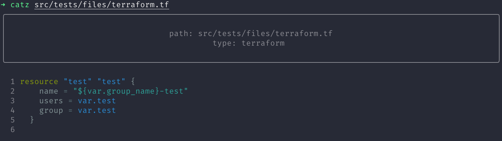

<!-- markdownlint-disable MD026 -->
# catz :pencil:

 [](https://badge.fury.io/py/jenkins-tui)

`catz` is a colourful syntax highlighting tool for your terminal.



🚀 This project is powered by [rich](https://github.com/willmcgugan/rich)!

## Installation and usage

You can install the latest release with pip:

```bash
pip install catz
```

Once the app is installed view the usage with:

```bash
catz --help
```

## Similar projects

* [bat](https://github.com/sharkdp/bat) - A cat(1) clone with wings.
