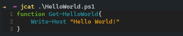

[](https://craigg.visualstudio.com/Pipelines/_build/latest?definitionId=24&branchName=master)

# jcat :pencil:

A colourful syntax highlighting tool for your terminal.

`jcat` is powered by [rich](https://github.com/willmcgugan/rich) and [pygments](https://github.com/pygments/pygments).

## Supported filetypes

`jcat` supports all of the lexers provided by pygments. You can find a full list [here](https://pygments.org/docs/lexers/).

## Install

Install the latest release from the Releases page or run the following:

```PowerShell
    Invoke-Expression ((New-Object System.Net.WebClient).DownloadString('https://raw.githubusercontent.com/chelnak/jcat/master/scripts/install.ps1'))
```

## Usage

### Print a file with syntax highlighting

```PowerShell
jcat ./HelloWorld.ps1
```



### List available themes

```PowerShell
jcat --list-themes
```

### Print a file with syntax highlighting and override the default theme

```PowerShell
jcat ./HelloWorld.ps1 --theme vs
```

### Show the content of a file with syntax highlighting and override the default theme with an environment variable

```PowerShell
$ENV:JCAT_THEME="vs"
jcat ./HelloWorld.ps1
```

## Releasing

1. git tag -a vX.X.X -m "Release vX.X.X"
2. git push --follow-tags
