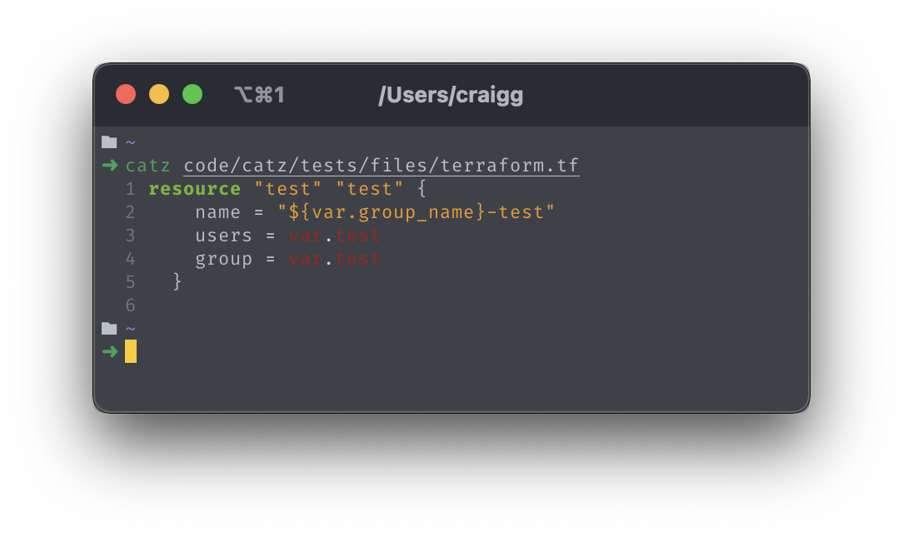

# catz :pencil:


`catz` is a colourful syntax highlighting tool for your terminal.




## Install

Install the latest release with pip:

```bash
pip install catz
```

## Usage


### Overriding the default theme

```bash
catz ./HelloWorld.ps1 --theme vs
```

### Overriding lexers

```bash
catz ./HelloWorld.ps1 --lexer json
```

### Line highlighting

Highlight individual lines

```bash
catz ./HelloWorld.ps1 --highlight 1,4
```

Highlight a range of lines

```bash
catz ./HelloWorld.ps1 -highlight 1-4
```

### List available themes

```bash
catz themes list
```

### Display examples of available themes

```bash
catz themes show
```

```bash
catz themes show --name vim
```

### List available lexers

```bash
catz lexers list
```
